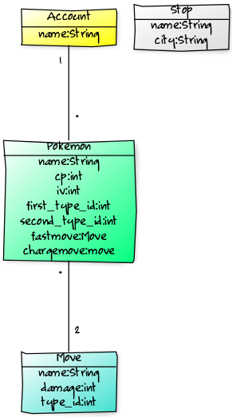

<h1>Tietokantakaavio</h1>

 
Tietokantaanohjelmaan kirjautuvat käyttäjät tallennetaan "trainer" tauluun. Jokaisella trainerilla voi olla monta Pokemonia, mutta
Pokemonilla voi olla vain yksi trainer. Pokemon -olioon liittyy kaksi kokonaislukua: CP (combat power) ja IV (individual value).
Tämän lisäksi Pokemoniin liittyy aina kaksi Move -oliota, fastMove ja chargeMove, mutta sama move voi olla käytössä usealla
Pokemonilla. Pokemoniin liittyy yhdestä kahteen Type -oliota. Move:lla on aina kokonaislukuarvoinen iskuvoima (damage). Myös Move
-olioilla on oma Type. Huomaa, että vaikka Pokemoniin liittyy kaksi Movea, joista molemmilla on Type, niin nämä tyypit ovat 
riippumattomia itse Pokemoniin liittyvästä yhdestä tai kahdesta tyypistä. Tämän lisäksi kaikilla tietokannan olioilla on 
luonnollisesti nimi (name). 
